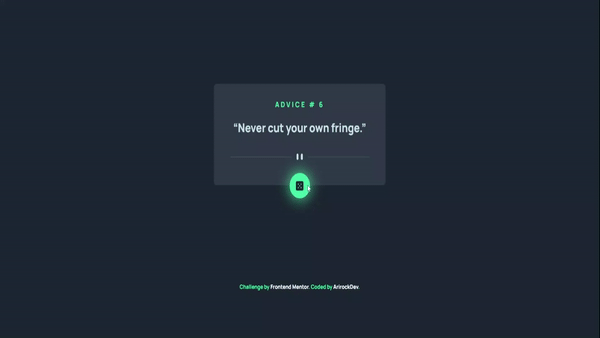

# Advice Generator App

"This is a web application that generates random tips obtained through an API. It is designed to practice using external APIs and DOM manipulation."

## Project demonstration

### I have used to complete this famous quotes project:
- Html
- CSS
- Javascript.

### Live Demo Project [here](https://advice-generator-app-main-frontend.netlify.app/)

If you want to try this app  
1- clone the repository

    https://github.com/Arirockdev/advice-generator-app-main.git

  2- open the `index.html` file in your browser

## For the app I used:

- Html 

- Css

- Javascript  
To handle the printing of the quote in the dom, I have used an asynchronous function, which handles the request to the api (`https://api.adviceslip.com/`). One function that handles the printing of the quotes in the dom and another function that handles any possible errors.
In this way I have modularized the code in a simple and orderly way for better reading.

#### This project belongs to the following [Frontend Mentor](https://www.frontendmentor.io/) challenge You can check it [here](https://www.frontendmentor.io/challenges/advice-generator-app-QdUG-13db)